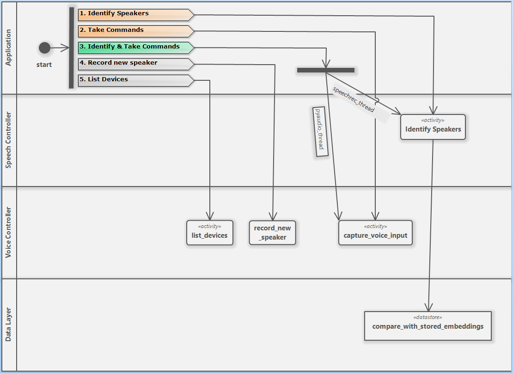

 # Voice App

## Overview
This application will do the folllowing:

1. Accept voice commands.
2. Record voice embedding metrics to a Mongo database.
3. Identify a person by their voice embedding values.

## Prerequisites
* Python 3.10
* Mongo 7.0.6
* Microphone

## Running the application
When run you will be presented with a command prompt menu.

```
1. Identify speakers
2. Take commands
3. Itentify & Take commands
===========================
4. Record new speaker
5. List devices
Enter your choice:
```

### 1. Identify speakers
This will open the audio stream and begin the voice detection process.  *It will listen continually until you stop it.*

Here you will see a stream of output helpful for fine-tuning the accuracy of the model.  It will look something like this:

```
Recording, diarizing, and identifying speakers...
Similarity with paul: 0.04005523098247954
Similarity with paul: 0.06279380456570616
Similarity with paul: 0.08013394758434311
Similarity with paul: -0.00124148449132222
Similarity with paul: 0.05710958602310978
Similarity with paul: 0.047580710947717986
Similarity with paul: -0.014161456069787137
Similarity with bill: 0.04883559569945839
Similarity with bill: 0.03490769180493225
Similarity with bill: 0.15175051628422032
Speaker identified as: bill
```

The application is comparing the audio sample it just heard to each row in the database.  Printing out each line obviously has a huge performance impact so only use as needed.  Then it concluded with Speaker identified as Bill.  This is because it uses the last known sample set and does not average the set of samples. 

The sample values on the right are the cosine similarity values.  If the value is above the value set as the ```similarity_threshold``` then it will consider it a match.

In this case Bill had a value of 0.15175051628422032 which was greater than the threhold of .1 so it identified him as the speaker.

### 2. Take Commands
This option will open the audio stream immediately and it will listen for voice commands.  There is a bit of a delay as this isn't threaded for continuous output so it will wait until you have finshed speaking before diarizating the audio to text.

You can edit the commands the and thier responses by editing the [commands.yaml](commands.yaml) file.  Right now the application name is stored in the [settings](app/Settings.py) file. So edits the two locations will setup the wake up command.

### 3. Identify Speakers & Take Commands
This option combines the first two.  It accomplishes this by running the two controllers in parallel threads concurrently.  Due to the commandline interface it does have some issues.  for instance it loops the main menu, and as a result, the output of the speech diaization doesn't always make it to the commandline.

This could be overcome by inhancing the user interface and further optimizing the thrteading.

### 4. Record new speaker
Selecting option 1 will allow you to record your voice.  The duration, or length, of this recording is based upon the value of ```sample_duration``` in the settings.py file.

You will be presented with a list of sentances you can read to help with the process.  The more samples you create of each user the better the accuracy will be.  This process could be improved but I felt that was outside the bounds of this project.

1. It will begin recording as soon as you hit enter.  Read one or more of the sentences.
2. Once the recording session is over it will prompt for a speaker ID.
3. Repeat as needed.

### 5. List Devices


### Diagrams
Below is a diagram of the application.  Options 1 and 2 are only for debug, while 3 runs the main application.  The two gray options are for administation.





### Improvements that could be made
1. Have the threshold for acuratcy be trained and not hard-coded.
2. Improve the speaker identification across all samples and not just the last.
3. Provide API services for the speech and voice controllers that can be synced and better optimized for a proper GUI.

docker compose up -d
docker compose down
docker compose build --progress=plain
docker ps
docker system prune -a

Open Source Libraries:
DeepSpeech - Low end, TensorFlow
Kaldi       - 
Wav2Letter  - Facebook AI
SpeechBrain - PyTorch
Coqui STT   - Multi-lingual